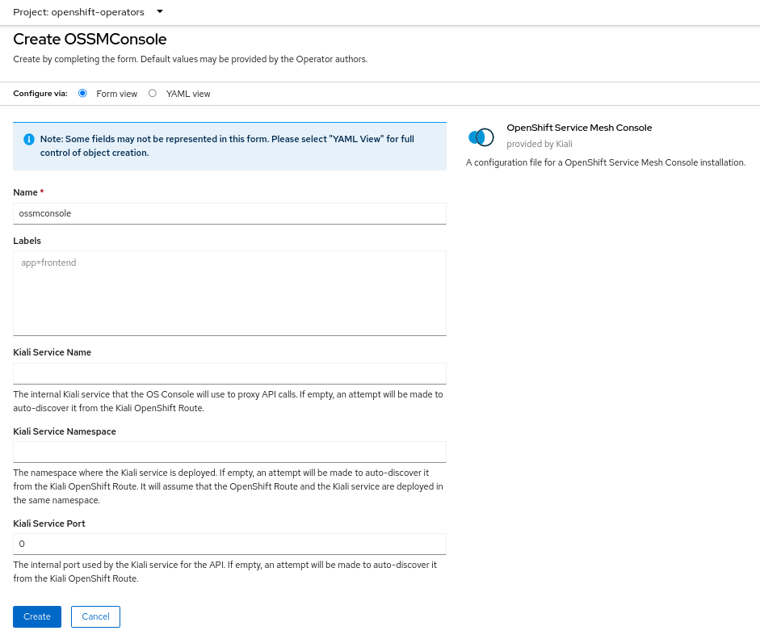
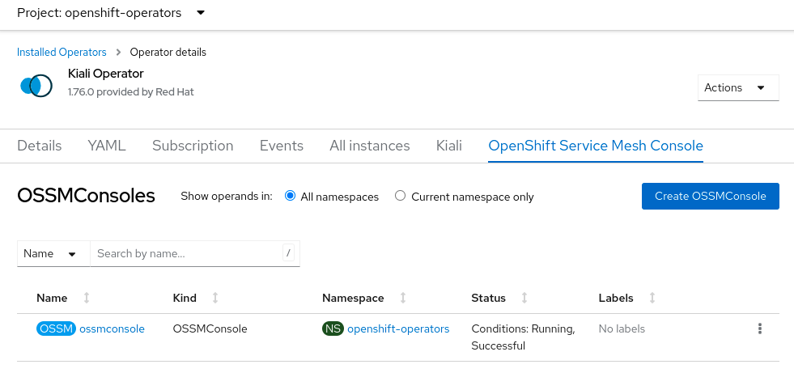
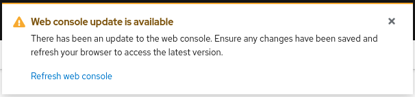
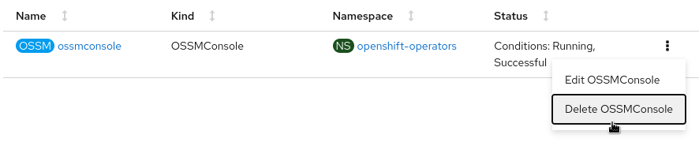

# OpenShift Service Mesh Console Install Guide

OpenShift Service Mesh Console (OSSMC) provides a Kiali integration with the OpenShift Console.

## Requirements

The main component of OSSMC is a plugin that gets installed inside the OpenShift Console. Prior to installing this plugin, you are required to have installed the following components:

- OpenShift
- Istio
- Kiali Operator
- Kiali Server

Please refer to the relevant documentation for details on how to install those components. You must have all of the above components installed and running before you can install the final component - the OSSMC plugin.

## Installing the Operator

Before you can install the OSSMC plugin itself, you first must install the Kiali Operator. Once installed, the operator will help with the installation of the plugin. The easiest way to do this is to install the Kiali Operator directly from the Operators>OperatorHub page of the OpenShift Console. You can alternatively opt to install the Kiali Operator via helm. Please see https://kiali.io/docs/installation/installation-guide/ for details on installing the Kiali Operator.

### Installing the Kiali Server

After you have installed the Kiali Operator, you should then install the Kiali Server. The Kiali Server is required to be installed in order for OSSMC to work. Please see https://kiali.io/docs/installation/installation-guide/ for details on installing the Kiali Server.

## Installing the Plugin

With the Kiali Operator and Kial Server installed and running, you can then install the OSSMC plugin.

:bulb: You can install the plugin in one of two ways - either via the OpenShift Console or via the "oc" CLI. Both methods are described below. You choose the method you want to use.

### Installing Plugin via OpenShift Console

From the Kiali Operator details page in the OpenShift Console, create an instance of the "OpenShift Service Mesh Console" resource. Accept the defaults on the installation form and press "Create".



### Installing Plugin via "oc" CLI

To instruct the Kiali Operator to install the plugin, simply create a small OSSMConsole custom resource (CR):

```bash
cat <<EOM | oc apply -f -
apiVersion: kiali.io/v1alpha1
kind: OSSMConsole
metadata:
  namespace: openshift-operators
  name: ossmconsole
EOM
```

Note that the operator will deploy the plugin resources in the same namespace where you create this OSSMConsole CR - in this case, `openshift-operators`.

### Plugin Installation Details

After the plugin is installed, you can see the "OSSMConsole" resource that was created in the OpenShift Console UI. Within the operator details page in the OpenShift Console UI, select the _OpenShift Service Mesh Console_ tab to view the resource that was created and its status.



Once the operator has finished processing the OSSMConsole CR, you must then wait for the OpenShift Console to load and initialize the plugin. This may take a minute or two. You will know when the plugin is ready when the OpenShift Console pops up this message - when you see this message, refresh the browser window to reload the OpenShift Console:



## Uninstalling

This section will describe how to uninstall the OpenShift Service Mesh Console plugin.

:bulb: You can uninstall the plugin in one of two ways - either via the OpenShift Console or via the "oc" CLI. Both methods are described in the sections below. You choose the method you want to use.

:warning: If you intend to also uninstall the Kiali Operator, it is very important to first uninstall the plugin and then uninstall the operator. If you uninstall the operator before ensuring the OSSMConsole CR is deleted then you may have difficulty removing that CR and its namespace. If this occurs then you must manually remove the finalizer on the CR in order to delete it and its namespace. You can do this via: `oc patch ossmconsoles <CR name> -n <CR namespace> -p '{"metadata":{"finalizers": []}}' --type=merge `

### Uninstalling the Plugin

#### Uninstalling Plugin via OpenShift Console

Remove the OSSMConsole CR by navigating to the operator details page in the OpenShift Console UI. From the operator details page, select the _OpenShift Service Mesh Console_ tab and then select the Delete option in the kebab menu.



#### Uninstalling Plugin via "oc" CLI

Remove the OSSMConsole CR via `oc delete ossmconsoles <CR name> -n <CR namespace>`. To make sure any and all CRs are deleted from any and all namespaces, you can run this command:

```sh
for r in $(oc get ossmconsoles --ignore-not-found=true --all-namespaces -o custom-columns=NS:.metadata.namespace,N:.metadata.name --no-headers | sed 's/  */:/g'); do oc delete ossmconsoles -n $(echo $r|cut -d: -f1) $(echo $r|cut -d: -f2); done
```
