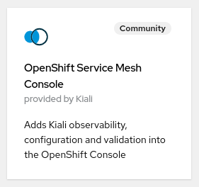
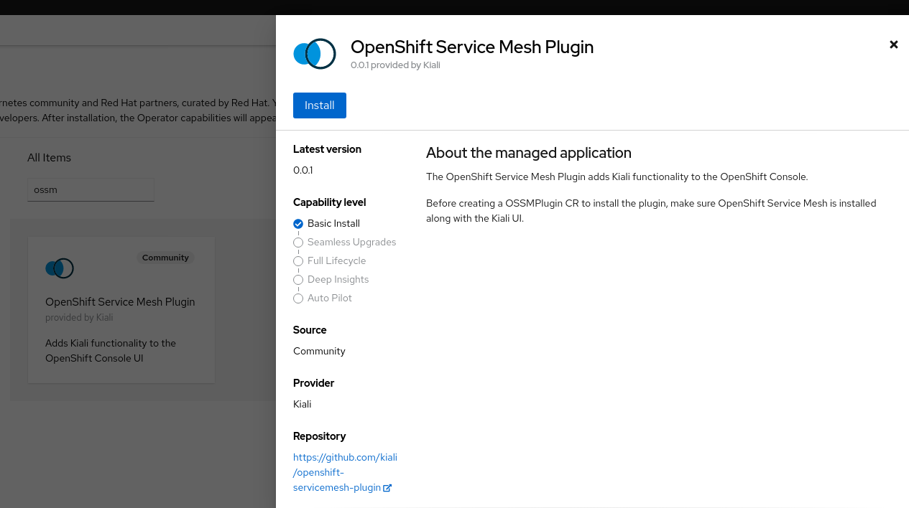
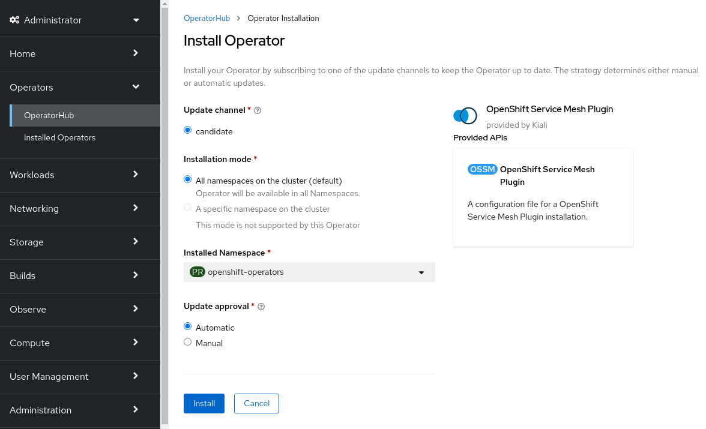
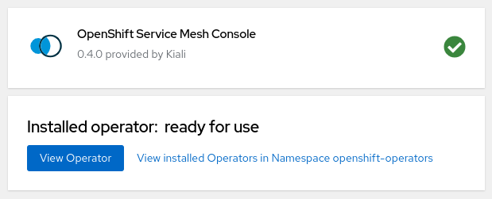
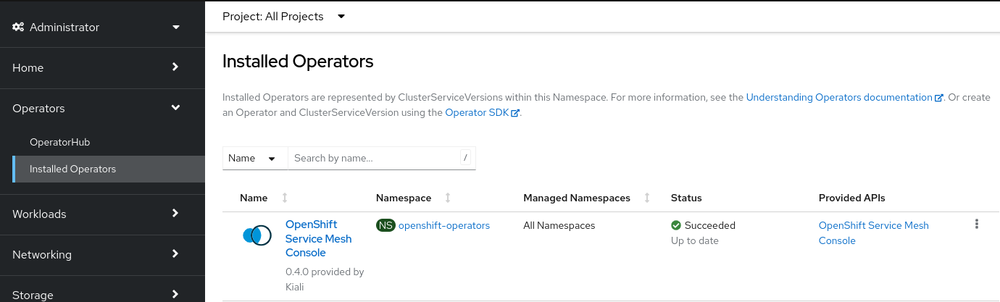
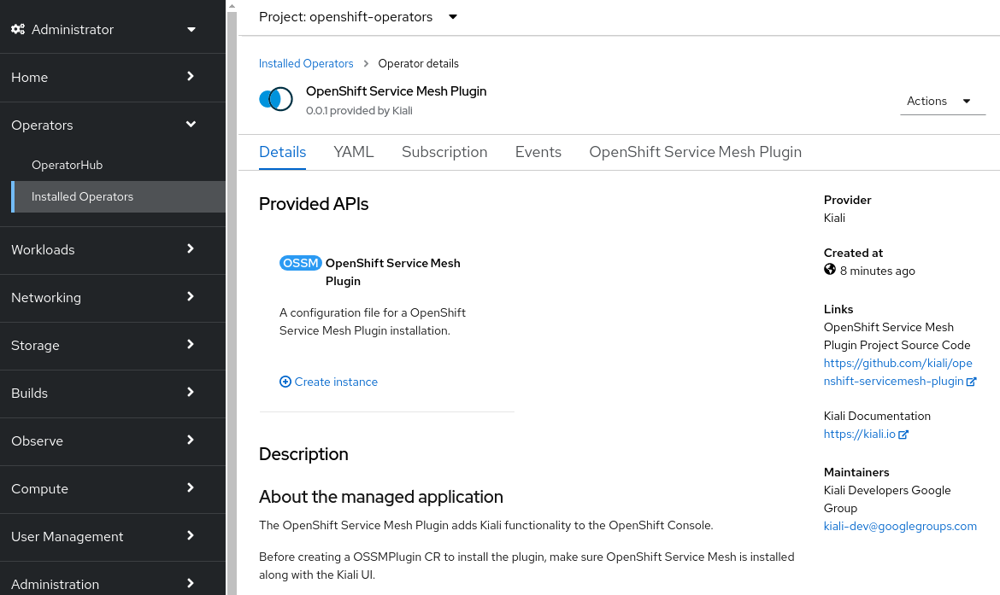
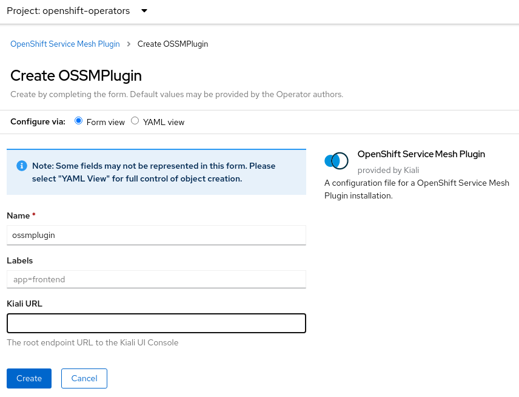
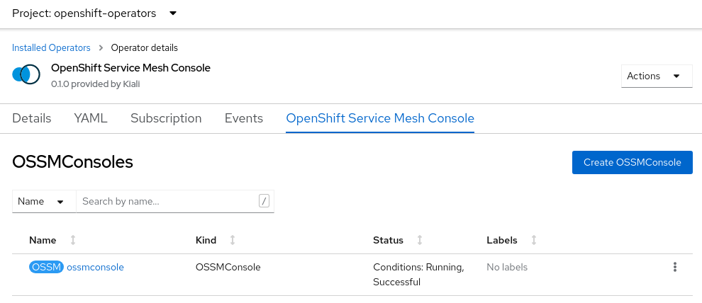
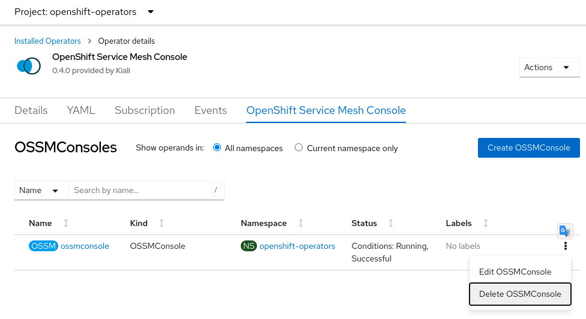
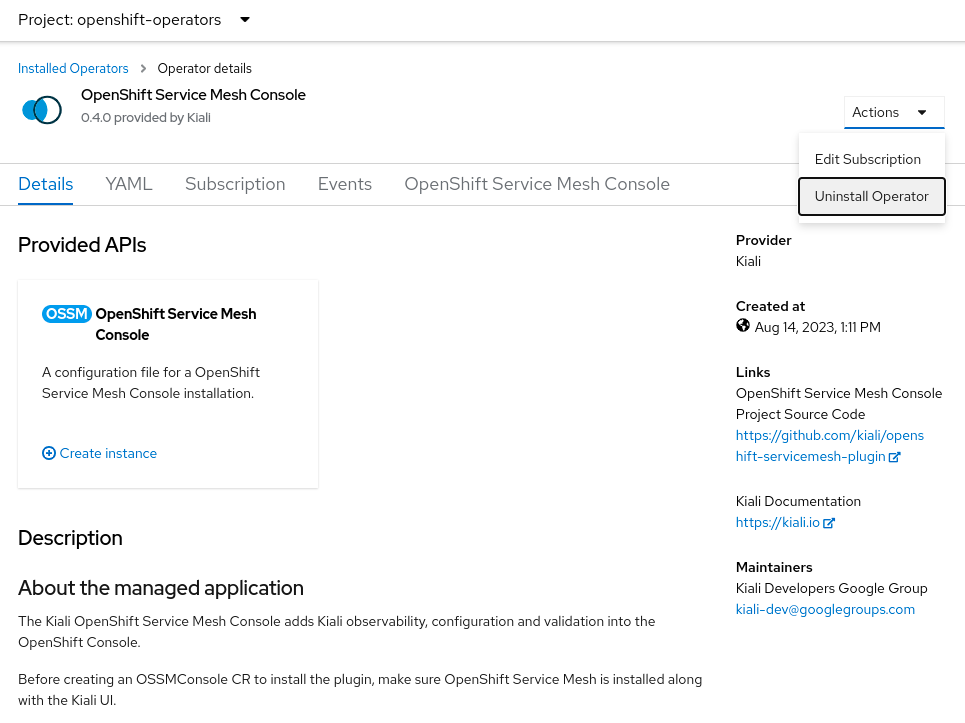

# OpenShift Service Mesh Plugin Install Guide

## Requirements

The OpenShift Service Mesh Plugin requires OpenShift v4.10+ with one of:

- Istio v1.14 with Kiali v1.56
- Istio v1.15+ with a compatible version of Kiali
- OpenShift Service Mesh (OSSM) v2.3+

Please refer to the relevant documentation for details on how to install those components.

## Installing the Operator

Before you can install the plugin itself, you first must install its operator via OLM. Once installed, the operator will help with the installation of the plugin.

### Installing Operator via OpenShift Console

The easiest way to install the operator is through the OpenShift Console UI. Log into the console as an Administrator (i.e. a user with kubeadmin privileges) and select `Operators > OperatorHub` from the left-hand menu. From there, find the _OpenShift Service Mesh Plugin_ operator in the list of available operators (look for the Kiali logo; it is published by the Kiali project team).



Click the "Install" button to begin the installation process.



Accept the defaults on the installation form and press "Install".



Once complete the operator will be installed within seconds.



### Installing Operator via "oc" CLI

If you want to install the operator via the CLI, you first need to use `oc` to log into the cluster as a user that has kubeadmin privileges. Once logged in, create a Subscription resource - this will install the operator:

```bash
cat <<EOM | oc apply -f -
apiVersion: operators.coreos.com/v1alpha1
kind: Subscription
metadata:
  name: ossmplugin
  namespace: openshift-operators
spec:
  installPlanApproval: Automatic
  name: ossmplugin
  source: community-operators
  sourceNamespace: openshift-marketplace
EOM
```

### Operator Installation Details

After the operator is installed, you can look at its details in the OpenShift Console UI. Within the OpenShift Console UI, select `Operators > Installed Operators` from the left-hand menu. From there, you will see that the list of installed operators should now include the _OpenShift Service Mesh Plugin_ operator.



Click the operator list entry to view the operator details page.



## Installing the Plugin

With the operator installed and running you can install the OpenShift Service Mesh Plugin. Again, you can do this via the Console or through the "oc" CLI.

### Installing Plugin via OpenShift Console

From the operator details page, create an instance of the "OpenShift Service Mesh Plugin" resource. Accept the defaults on the installation form and press "Create".



### Installing Plugin via "oc" CLI

To instruct the operator to install the plugin, simply create a small OSSMPlugin custom resource (CR):

```bash
cat <<EOM | oc apply -f -
---
apiVersion: v1
kind: Namespace
metadata:
  name: ossmplugin
---
apiVersion: kiali.io/v1alpha1
kind: OSSMPlugin
metadata:
  namespace: ossmplugin
  name: ossmplugin
EOM
```

Note that the operator will deploy the plugin resources in the same namespace where you create this OSSMPlugin CR.

### Plugin Installation Details

After the plugin is installed, you can see the "OSSMPlugin" resource that was created in the OpenShift Console UI. Within the operator details page in the OpenShift Console UI, select the _OpenShift Service Mesh Plugin_ tab to view the resource that was created and its status.



## Uninstalling

You can uninstall the OpenShift Service Mesh Plugin and its operator either through the OpenShift Console UI or the "oc" CLI.

:warning: Regardless of which mechanism you use to perform the uninstall, it is very important to first uninstall the plugin (i.e. uninstall the OSSMPlugin CR first) and then uninstall the operator. If you uninstall the operator before ensuring the OSSMPlugin CR is deleted then you may have difficulty removing that CR and its namespace. If this occurs then you must manually remove the finalizer on the CR in order to delete it and its namespace. You can do this via: `oc patch ossmplugins <CR name> -n <CR namespace> -p '{"metadata":{"finalizers": []}}' --type=merge `

### Uninstalling the Plugin

You first must uninstall the plugin. Make sure this is complete before uninstalling the operator.

#### Uninstalling Plugin via OpenShift Console

Remove the OSSMPlugin CR by navigating to the operator details page in the OpenShift Console UI. From the operator details page, select the _OpenShift Service Mesh Plugin_ tab and then select the Delete option in the kebab menu.



#### Uninstalling Plugin via "oc" CLI

Remove the OSSMPlugin CR via `oc delete ossmplugins <CR name> -n <CR namespace>`. To make sure any and all CRs are deleted from any and all namespaces, you can run this command:

```sh
for r in $(oc get ossmplugins --ignore-not-found=true --all-namespaces -o custom-columns=NS:.metadata.namespace,N:.metadata.name --no-headers | sed 's/  */:/g'); do oc delete ossmplugins -n $(echo $r|cut -d: -f1) $(echo $r|cut -d: -f2); done
```

### Uninstalling the Operator

#### Uninstalling Operator via OpenShift Console

Remove the operator by navigating to the operator details page in the OpenShift Console UI. From the operator details page, select the "Uninstall Operator" option from the _Actions_ menu.



#### Uninstalling Operator via "oc" CLI

Uninstalling the operator entails deleting the Subscription and all CSVs that OLM created.

```sh
oc delete subscription ossmplugin -n openshift-operators
for csv in $(oc get csv --all-namespaces --no-headers -o custom-columns=NS:.metadata.namespace,N:.metadata.name | sed 's/  */:/g' | grep ossmplugin) ;\
do \
  oc delete --ignore-not-found=true csv -n $(echo -n ${csv} | cut -d: -f1) $(echo -n ${csv} | cut -d: -f2) ;\
done
```

### Uninstalling the CRD

Regardless of how you uninstalled the plugin and the operator, OLM will not remove the CRD. If you want to completely remove all remnants of the OpenShift Service Mesh plugin and its operator, you will want to also delete the CRD.

```sh
oc delete crd ossmplugins.kiali.io
```
