# OpenShift Service Mesh Console User Guide

The OpenShift Service Mesh Console (aka OSSMC) is an extension to the OpenShift Console which provides visibility into your Service Mesh. With OSSMC installed you will see a new _Service Mesh_ menu option on the left-hand side of the Console, as well as new _Service Mesh_ tabs that enhance existing Console pages such as the _Workloads_ and _Services_ pages.

The features you see described here are very similar to those of the standalone Kiali Console (see https://kiali.io). In fact, you can still access the standalone Kiali Console if you wish. This User's Guide, however, will discuss the functionality that you see from within the OpenShift Console itself.

:warning: The OSSMC [only supports a single tenant today](https://github.com/kiali/openshift-servicemesh-plugin/issues/28). Whether that tenant is configured to access only a subset of OpenShift projects or has access cluster-wide to all projects does not matter, however, only a single tenant can be accessed.

# Overview

The _Overview_ page provides a summary of your mesh by showing cards representing the namespaces participating in the mesh. Each namespace card has summary metric graphs and additional health details. There are links in the cards that take you to other pages within OSSMC.

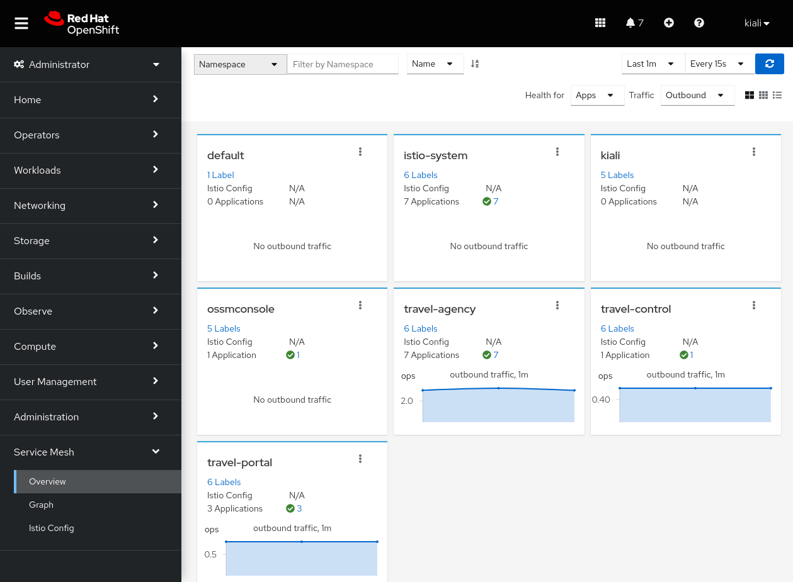

# Graph

The _Graph_ page provides the full topology view of your mesh. The mesh is represented by nodes and edges - each node representing a component of the mesh and each edge representing traffic flowing through the mesh between components.

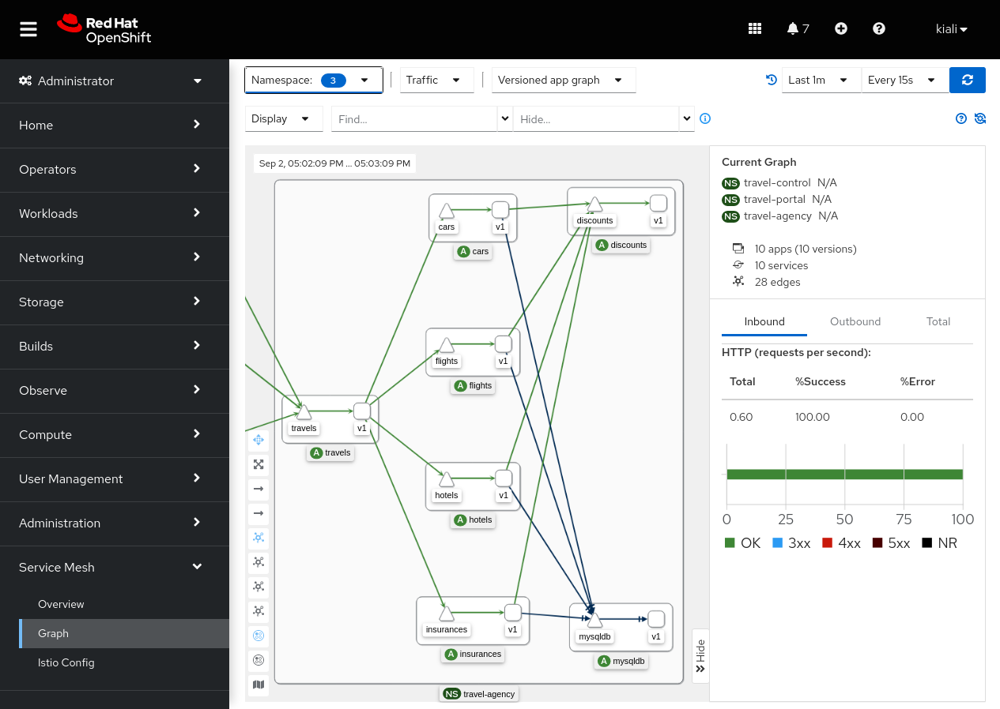

# Istio Config

The _Istio Config_ page provides a list of all Istio configuration files in your mesh with a column that provides a quick way to know if the configuration for each resource is valid.

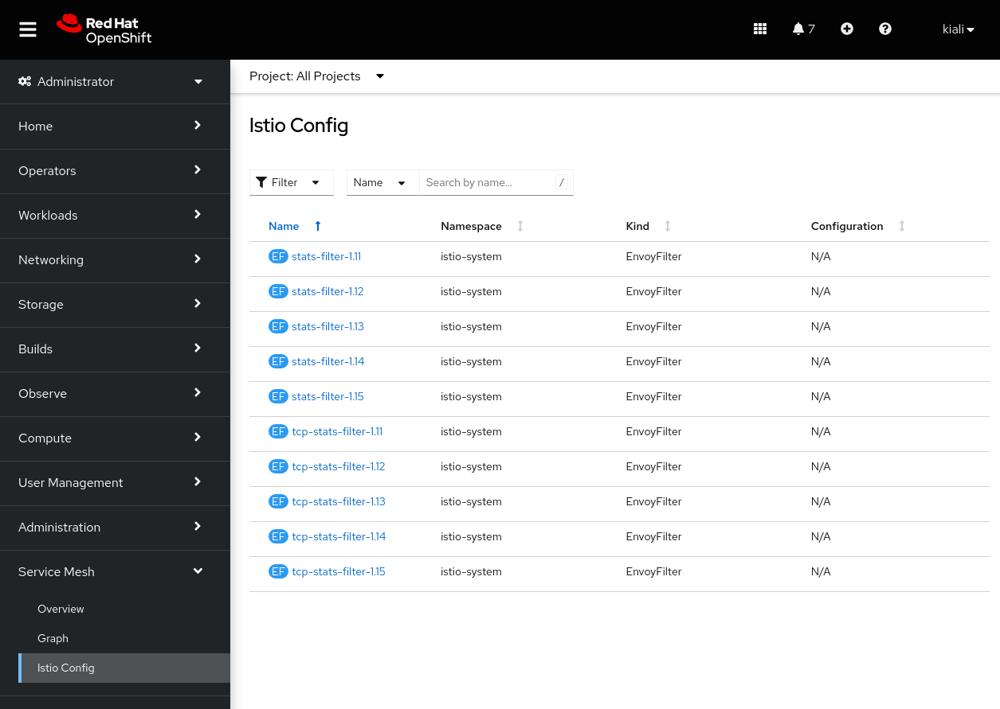

# Workload

The _Workloads_ view has a tab _Service Mesh_ that provides a lot of mesh-related detail for the selected workload. The details are grouped into several sub-tabs: Overview, Traffic, Logs, Inbound Metrics, Outbound Metrics, Traces, and Envoy.

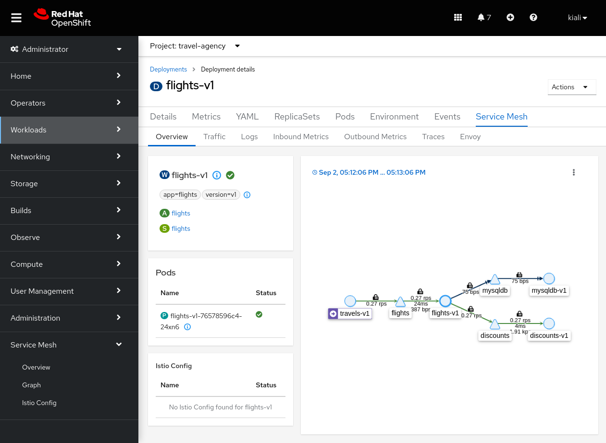

## Workload: Overview

The _Workload: Overview_ sub-tab provides a summary of the selected workload including a localized topology graph showing the workload with all inbound and outbound edges and nodes.

## Workload: Traffic

The _Workload: Traffic_ sub-tab provides information about all inbound and outbound traffic to the workload.

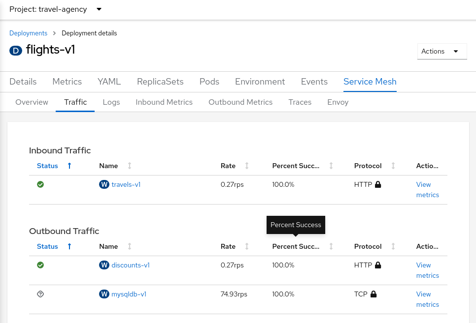

## Workload: Logs

The _Workload: Logs_ sub-tab provides the logs for the workload's containers. You can view each container logs individual or see them intermixed ordered by log time. This is especially helpful to see the Envoy sidecar proxy logs and how they relate to your workload's own logs. You can enable the tracing span integration which allows you to see which logs correspond to tracing spans.

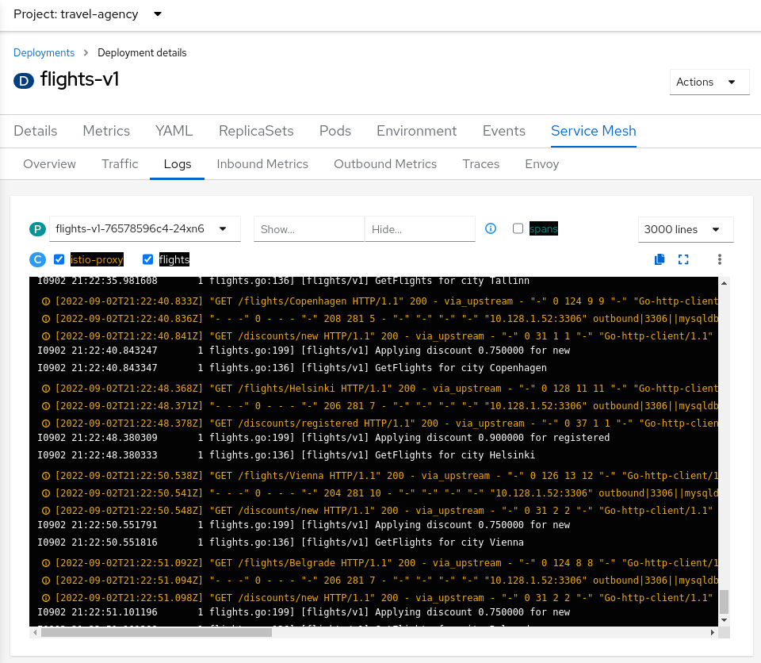

## Workload: Metrics

You can see both inbound and outbound metric graphs in the corresponding sub-tabs. All the workload metrics can be displayed here, providing you with a detail view of the performance of your workload. You can enable the tracing span integration which allows you to see which spans occurred at the same time as the metrics. You can then click on a span marker in the graph to view the specific spans associated with that timeframe.

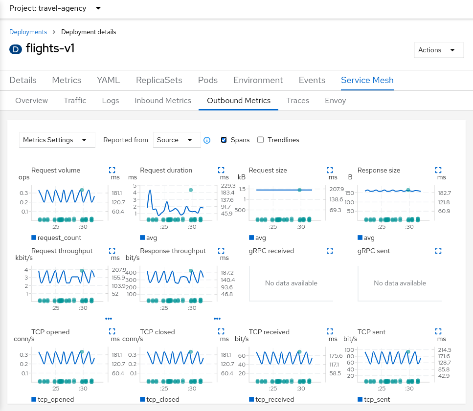

## Workload: Traces

The _Traces_ sub-tab provides a graph that illustrates the trace spans that were collected over the given timeframe. Click on a bubble to drill down into those trace spans; the trace spans can provide you the most low-level detail within your workload application, down to the individual request level.

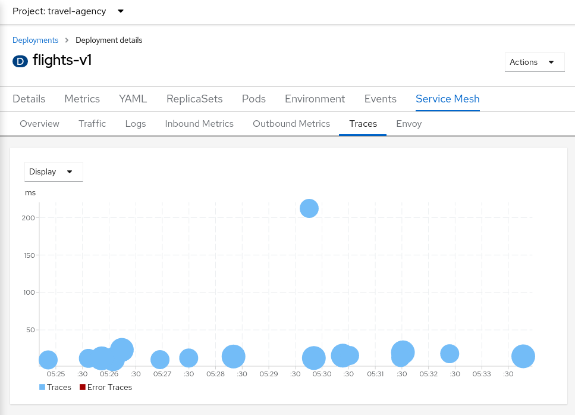

The trace details view will give further details, including heatmaps that provide you with a comparision of one span in relation to other requests and spans in the same timeframe.

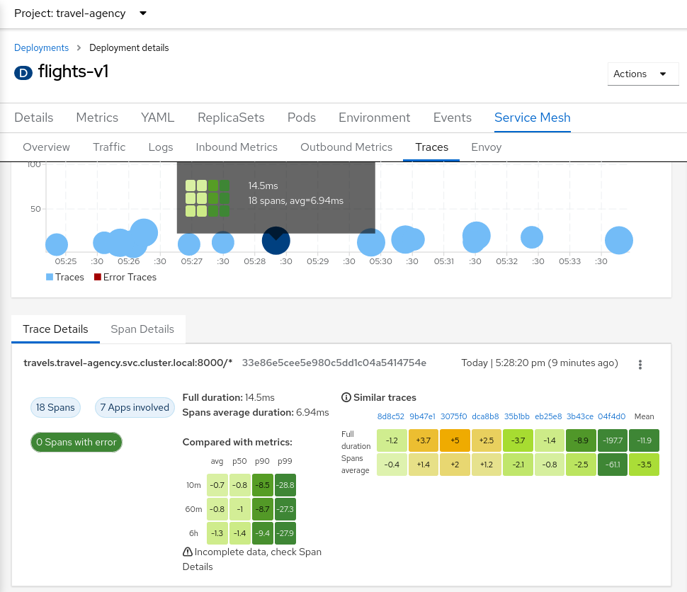

If you hover over a cell in a heatmap, a tooltip will give some details on the cell data:

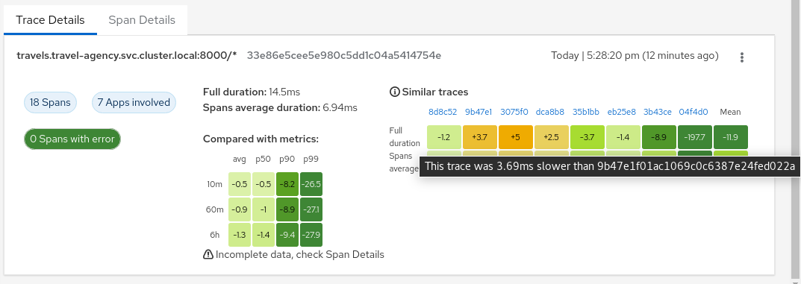

## Workload: Envoy

The _Envoy_ sub-tab provides information about the Envoy sidecar configuration. This is useful when you need to dig down deep into the sidecar configuration when debugging things such as connectivity issues.

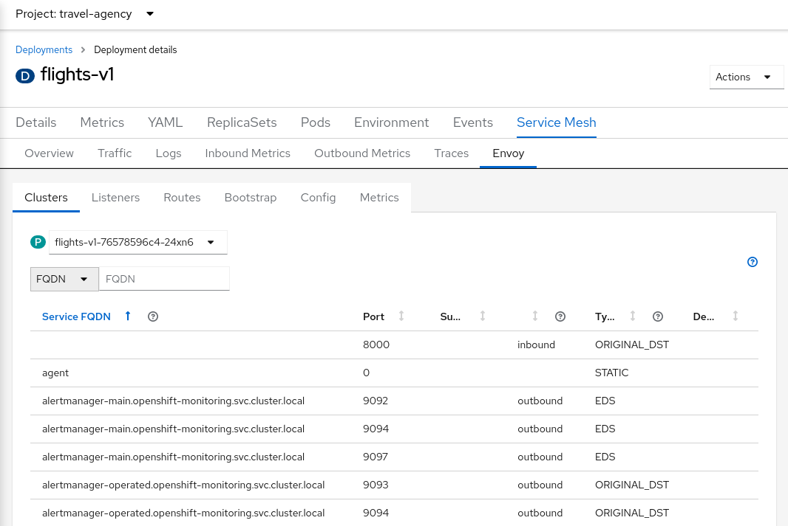

# Services

The _Services_ view has a tab _Service Mesh_ that provides mesh-related detail for the selected service. The details are grouped into several sub-tabs: Overview, Traffic, Inbound Metrics, Traces. These sub-tabs are similar in nature as the Workload sub-tabs with the same names and serve the same functions.

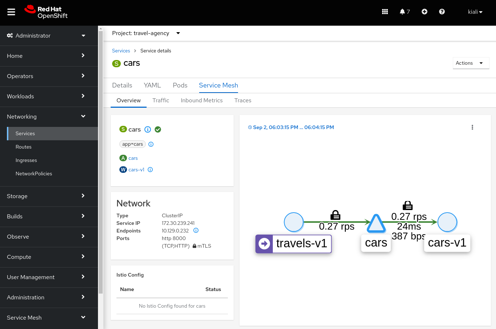

